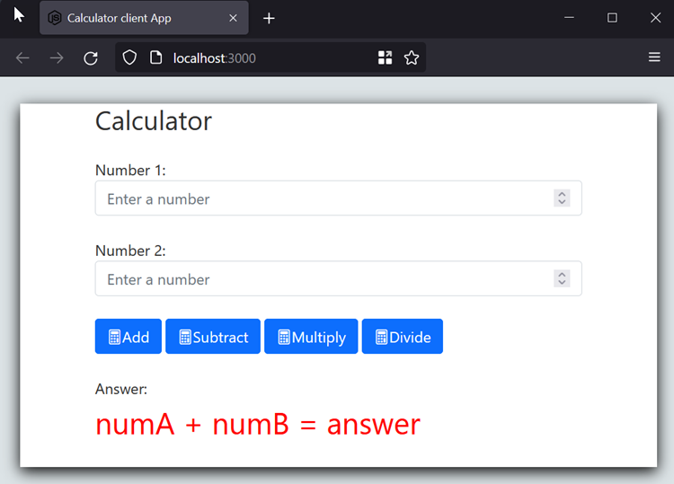
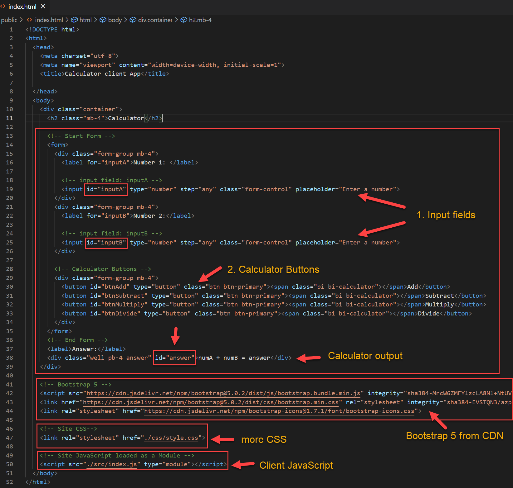
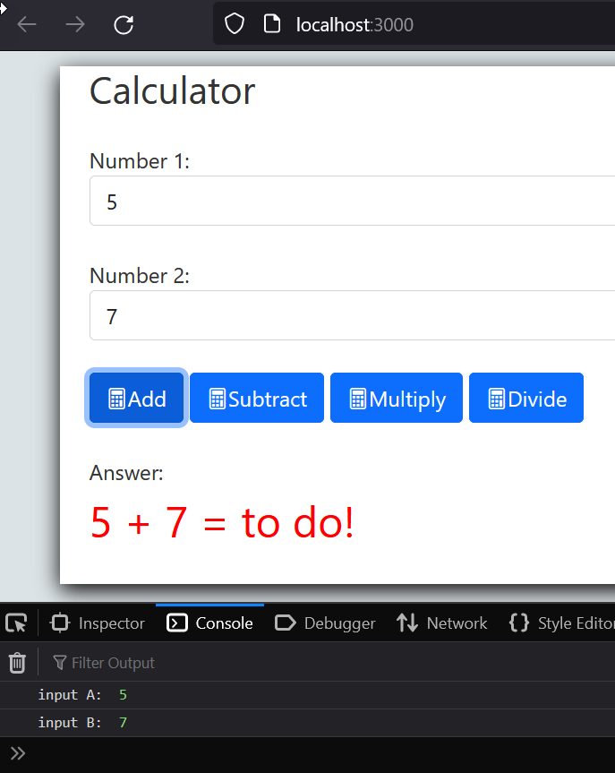
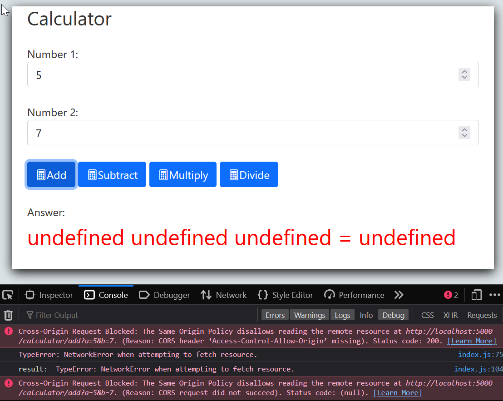
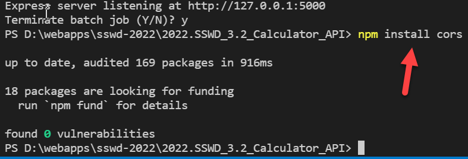
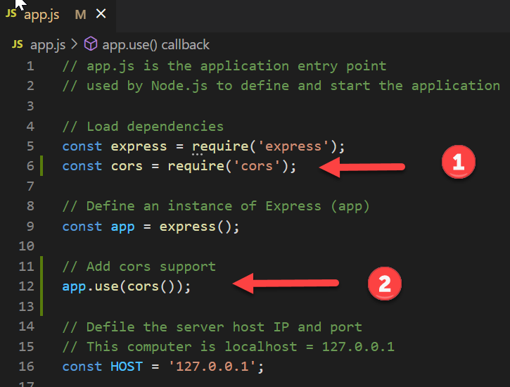
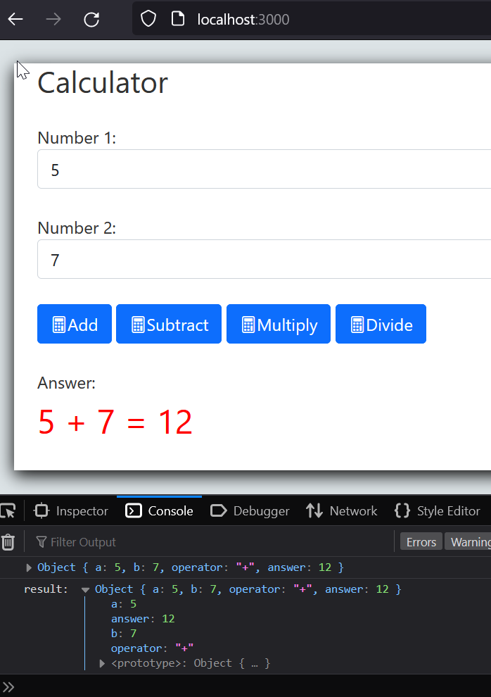

# Build a web API using Node and Express: Part 3

#### Calculator Client Web App

## Introduction

The purpose of this lab tutorial is to demonstrate web client interaction with server-side API interaction based on a simple example (from the previous tutorial). The simple calculations could be carried out using client-side JavaScript alone, however this is just the first step.

## Prerequisites

This tutorial is dependant on the completed API from **[part 2](https://github.com/elee-tudublin/2022.SSWD_3.2_Calculator_API)**. The client application which you will build here will retrieve data from the API and display it in a web page..

You will need the web API running on <http://localhost:5000> to accept calculation requests and respond with results.

The instructions here refer to the starter example in this repository which you should download and open in VS Code.


## The client Application

With the server running, open <http://localhost:3000> in a browser, the index.html page will be loaded.

It should look like this with form fields for data entry, buttons to perform calculations (by calling the API), and a space to show the result (from the API).



## The main page (index.html) and calculator form

The calculator page, and HTML form, has three main functions:

1.  Accept user **input** via the form fields

2.  Perform a **calculation** via the API when a **button** is pressed.

3.  Display the **result** (sent as a response by the API).

The full page is included in the client app repository, here is an screenshot of the most important parts.



## Handling user input and performing a calculation

When a user has filled the two inputs and is ready to perform a calculation, they will click the appropriate button. For example, to add, enter two values and click/ press the add button.

Our first step is to write a function (or functions) to accomplish this, e.g., for the Add button. Functions should be added to **/public/src/index.js**, the main script for the client app.

The first version will output to the browser console only to show it works before we proceed.

### A function to add two numbers: ```calcAdd()```

```javascript
// Call this function when Add button is clicked

async function calcAdd() {

    // declare two variables for the two numbers which will be added
    let numA = 0;
    let numB = 0;
    let answerText = "";
    
    // use getElementById() to read values from the form
    // convert the (text)inputs to numbers and assign to the variables
    
    numA = Number(document.getElementById('inputA').value);
    numB = Number(document.getElementById('inputB').value);
    
    // Log to the browser console to see if it worked
    console.log('input A: ', numA);
    console.log('input B: ', numB);
    
    // Build the answer text - inputs only for now
    answerText = `${numA} + ${numB} = to do!`;
    
    // display the two inputs on the page
    // first get a reference to the correct page element
    // then set the element's innerText = answeText
    document.getElementById('answer').innerText = answerText;
    
    // To do or complete:
    // 1. Call the correct API endpoint with the two paramters
    // 2. Get the result and build the answer test
    // 3. display on the page
    
    }
```

After adding the function save **index.js** and reload the client app in your browser. You should notice that the add button doesn’t yet call the function. That’s because we haven’t added an event listener yet.

Whenever the page loads we need to associate the **```calcAdd()```** function with its button. The following function, **```loadCalculator()```** adds an **Event Listener** for the add button.

Define the function after **```calcAdd()```** and then call the function so that it
executes whenever the page is loaded.

```javascript
// Initialise the app when the page is loaded 
function loadCalculator() {
  // Add a click event listner to the calcAdd button
  document.getElementById('btnAdd').addEventListener('click', calcAdd);
}

// load the script
loadCalculator();

// Functions to export
export {
  loadCalculator,
  calcAdd
}
```


### Now try it

Open the browser console to see the log. Check if the input values were read correctly and displayed on the page.



## Calling the API

The JavaScript fetch API will be used to send a request to the correct API endpoint with the input parameters, and then receive the response back.

For the addition function, the endpoint is **```http://localhost:5000/calculator/add?a=5&b=7```**

Before starting, make sure that the server-side API is running and listening on <http://localhost:5000>

### Some settings required connecting to the API via the Fetch API

1.  The **Base URL** for the API, this is <http://localhost:5000/calculator>

2.  Headers to specify the data content type, etc.

3.  HTTP method and other parameters used when making a request

```javascript
// The server http address for the calculator API
const BASE_URL = 'http://localhost:5000/calculator';

// HTTP request settings

// HTTP headers: specify the content which will be accepted
const headers = new Headers({
  "Accept": "application/json",
  "Content-Type": "application/json",
});

// This will be sent as part of the request, specifies:
// HTTP method
// Headers
// CORS - cross orgin request (client and api may be hosted on different domains or IPs)
const reqInit = { method: 'GET', headers: headers, mode: 'cors', cache: 'default' };
```


### The getDataAsync(url) function

This function will be used whenever data from the API is required. The **url** parameter should define the exact endpoint and include parameters required. The function returns any JSON data sent in the response.

```javascript
// Asynchronous Function getDataAsync from a url and return

async function getDataAsync(url) {
    // Check for errors and catch any exceptions
    try {
        // Use fetch to call the api asychronously
        // Initally returns a promise
        const response = await fetch(url, reqInit);

        // As Resonse is dependant on the fetch call, await must also be used here
        const json = await response.json();

        // Output result to console (for testing purposes)
        console.log(json);

        // return data
        return json;

        // catch and log any errors
    } catch (err) {
        console.log(err);
        return err;
    }
} // End function
```


### Modify calcAdd() so that it uses the API

The JSON returned by the API is stored in the result variable. This **result** is an object containing the result:


The values contained in **result** can be referenced as ```result.a```, ```result.b``` etc. (see the code below). 

```javascript
// Call this function when Add button is clicked
// Note this is an async function because it calls other async functions.
async function calcAdd() {

  // declare two variables for the two numbers which will be added
  let numA = 0;
  let numB = 0;
  let answerText = "";

  // use getElementById() to read values from the form
  // convert the (text)inputs to numbers and assign to the variables
  numA = Number(document.getElementById('inputA').value);
  numB = Number(document.getElementById('inputB').value);

  // 1. Build the API URL, starting with BASE_URL
  const url = `${BASE_URL}/add?a=${numA}&b=${numB}`;

  // 2. Call the API and get a result
  const result = await getDataAsync(url);

  // 3. Process the result and build the answer

  // Log to the browser console to see if it worked and also what the JSON contains
  console.log('result: ', result);

  // Build the answer text using the values returned: a + b = answer
  answerText = `${result.a} ${result.operator} ${result.b} = ${result.answer}`;

  // display the two inputs on the page
  // first get a reference to the correct page element
  // then set the element's innerText = answeText
  document.getElementById('answer').innerText = answerText;

} // end function
```


## Test again

This time the answer should be displayed. Make sure that both client and server applications are running.

**Don’t forget to reload the browser so that changes take effect!**

Also open the browser console to see any errors.



This doesn’t look too good! The error states -  *Cross-Origin Request Blocked: The Same Origin Policy disallows reading the remote resource*.

Earlier we set CORS (Cross Origin Resource Sharing) as an option in the request header, however that only works if the server-side it set to allow cross-origin requests from http://localhost:3000 to http://localhost:5000.

### Enable CORS in the API

The CORS NPM package makes it easy to configure Cross Origin Resource Sharing in the server application.

1.  Stop the server app using ctrl-c. Then install the CORS package using **```npm install cors```**
    
    
    
2.  Load the CORS module in app.js (server-side)

    


## Test the Client App again

This time it should work. Check the browser console to see the raw JSON data returned by the API




## Complete client-side script.js

```javascript
// Calculator Functions

// The server http address for the calculator API
const BASE_URL = 'http://localhost:5000/calculator';

// HTTP request settings

// HTTP headers: specify the content which will be accepted
const headers = new Headers({
  "Accept": "application/json",
  "Content-Type": "application/json",
});

// This will be sent as part of the request, specifies:
// HTTP method
// Headers
// CORs - cross orgin request (client and api may be hosted on different domains or IPs)
const reqInit = { method: 'GET', headers: headers, mode: 'cors', cache: 'default' };

// Asynchronous Function getDataAsync from a url and return
async function getDataAsync(url) {
  // Check for errors and catch any exceptions
  try {
    // Use fetch to call the api asychronously
    // Initally returns a promise
    const response = await fetch(url, reqInit);
    // As Resonse is dependant on the fetch call, await must also be used here
    const json = await response.json();
    // Output result to console (for testing purposes) 
    console.log(json);

    // return data
    return json;

    // catch and log any errors
  } catch (err) {
    console.log(err);
    return err;
  }
} // End function


// Call this function when Add button is clicked
// Note this is an async function because it calls other async functions.
async function calcAdd() {

  // declare two variables for the two numbers which will be added
  let numA = 0;
  let numB = 0;
  let answerText = "";

  // use getElementById() to read values from the form
  // convert the (text)inputs to numbers and assign to the variables
  numA = Number(document.getElementById('inputA').value);
  numB = Number(document.getElementById('inputB').value);

  // 1. Build the API URL, starting with BASE_URL
  const url = `${BASE_URL}/add?a=${numA}&b=${numB}`;

  // 2. Call the API and get a result
  const result = await getDataAsync(url);

  // 3. Process the result and build the answer

  // Log to the browser console to see if it worked and also what the JSON contains
  console.log('result: ', result);

  // Build the answer text - inputs only for now
  answerText = `${result.a} ${result.operator} ${result.b} = ${result.answer}`;

  // display the two inputs on the page
  // first get a reference to the correct page element
  // then set the element's innerText = answeText
  document.getElementById('answer').innerText = answerText;

} // end function


// Initialise the app when the page is loaded 
function loadCalculator() {
  // Add a click event listner to the calcAdd button
  document.getElementById('btnAdd').addEventListener('click', calcAdd);
}

// load the script
loadCalculator();

// Functions to export
export {
  loadCalculator,
  calcAdd
}
```


## Exercises:

1.  Following the example, add functionality for the other calculator buttons -
    subtract, multiply, and divide.

------

**Enda Lee 2022**

